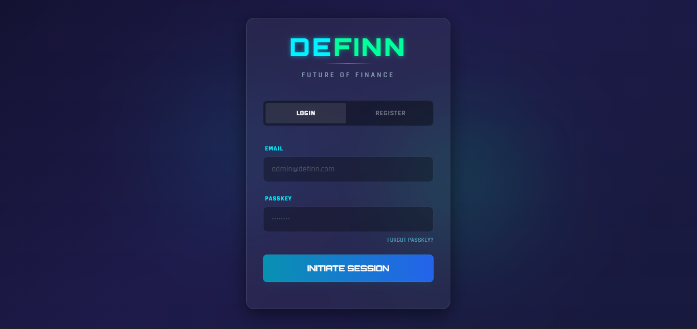
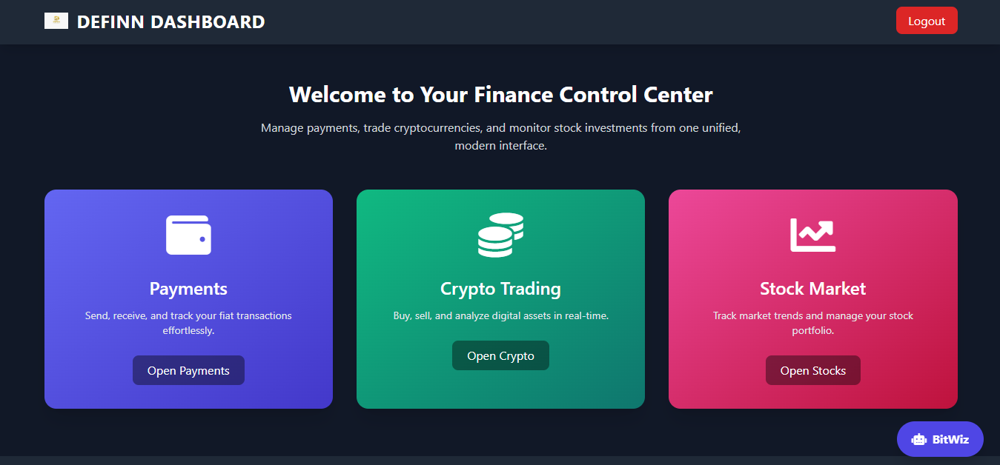
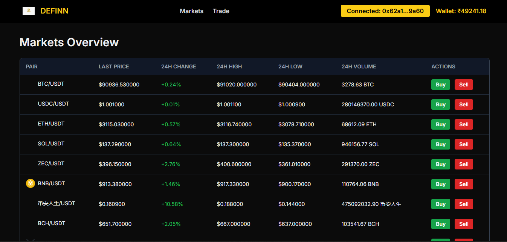
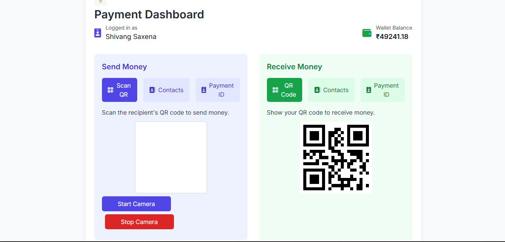

> *PRESS CTRL + SHIFT + V FOR README PREVIEW
OPEN WITH VS CODE*

> # DOMAIN : FINTECH

> # DEFINN – Unified Finance Platform

 *Where Stocks, Crypto, and UPI meet in one ecosystem.*

## 🚀 Overview

**DEFINN** is a unified financial platform prototype that combines:

- 📈 **Stock Trading**
- 🪙 **Cryptocurrency Trading**
- 💸 **UPI & Digital Wallet Payments**

into a **single, seamless interface**.

The project aims to reduce fragmentation between traditional finance (stocks & UPI) and Web3 (crypto wallets) by allowing users to manage all assets from one dashboard.

## 🧩 Problem Statement

Currently, users manage:
- Stocks on one platform  
- Crypto on another  
- Payments via separate UPI apps  

This leads to:
- Poor fund interoperability
- Manual transfers
- Fragmented user experience

**DEFINN solves this by acting as a bridge between all three.**

## 🧠 Core Modules

> ### Login Page
- Controls user logins and registration
- Also redirects the user if he/she accidently tries to access dashboard

> ### Main Dashboard
- Connects all three modules together 
- Hub of all core modules/pages

> ### 1️⃣ Stock Trading Module
- Live stock price simulation
- Buy & Sell stocks
- Portfolio tracking
- Order history
- Funds management (Add / Withdraw)

📷 *Stock Trading Interface*

> ### 2️⃣ Crypto Trading Module
- Real-time crypto market data 
- MetaMask wallet connection
- Buy & Sell crypto assets
- Ethereum transaction simulation
- Live crypto news feed

📷 *Crypto Market Interface*

> ### 3️⃣ UPI & Wallet Module
- Send & receive money
- QR code payments
- Payment ID transfers
- Contact-based transfers
- Transaction history

📷 *UPI / Wallet Interface*

## 💰 Unified Fund Flow

This enables:
- Buying stocks using UPI funds
- Purchasing crypto using wallet balance
- Withdrawing profits back to UPI

## ⚠️ Disclaimer

This project is a **prototype built for hackathon purpose**.  
All transactions are **simulated** and **no real money** is involved.

## 👨‍💻 Team 

- SHIVANG SAXENA (LEADER)
- SUHANI SAXENA
- KANISHK GULATI
- MAANYA SAXENA

> *To run the project follow these steps :-*
- Download all the folders
- Put Templates folder inside the Backend folder
- We have put them separately in our repository so that backend and frontend remain separate
- Run command = python app.py in the terminal
- Access the login page in your web browser by  http://localhost:3000/login
- Register and Login to your dashboard and access all the platforms

**DEFINN – Simplifying Finance, One Platform at a Time.**
