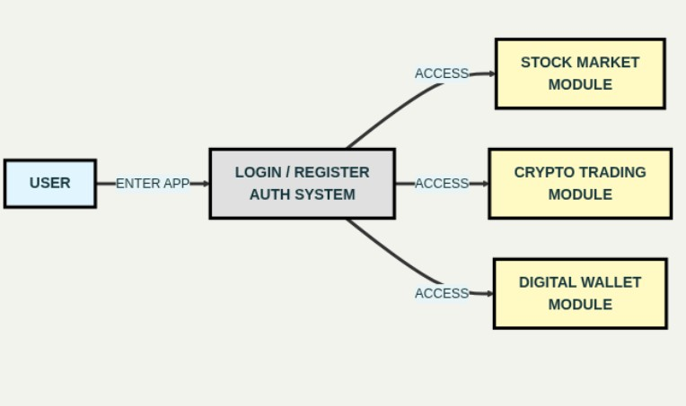
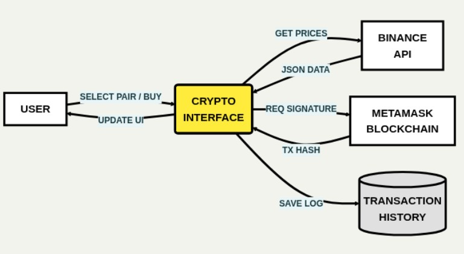
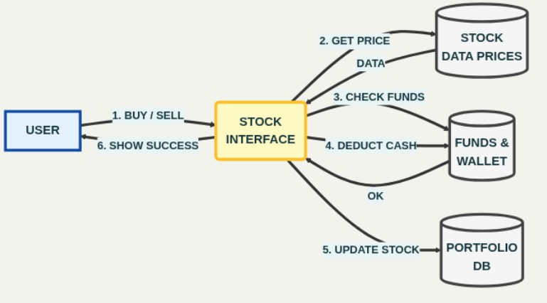
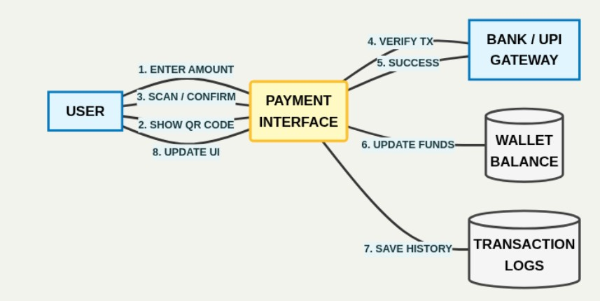
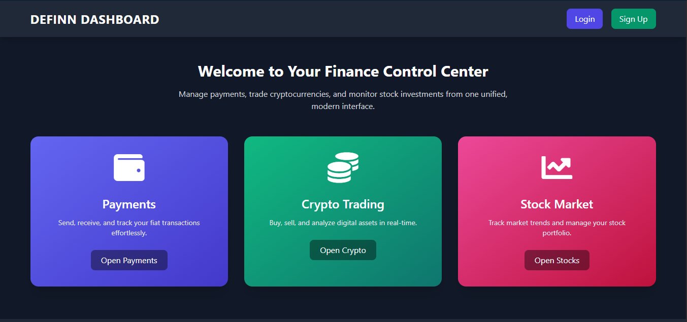
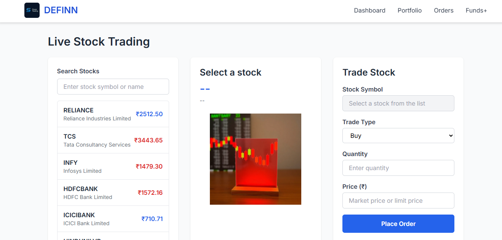
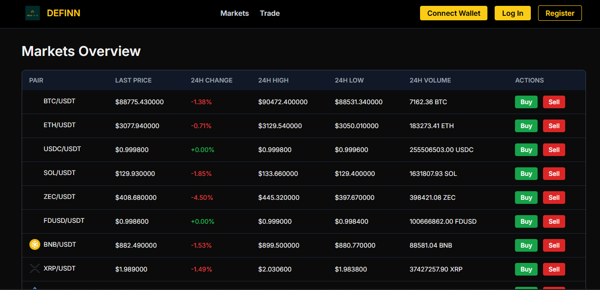
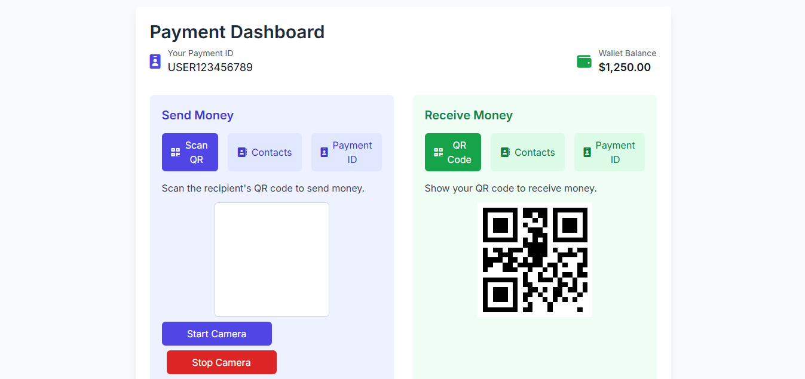

> *PRESS CTRL + SHIFT + V FOR README PREVIEW
OPEN WITH VS CODE*

> # DOMAIN : FINTECH

> # DEFINN – Unified Finance Platform

 *Where Stocks, Crypto, and UPI meet in one ecosystem.*

## 🚀 Overview

**DEFINN** is a unified financial platform prototype that combines:

- 📈 **Stock Trading**
- 🪙 **Cryptocurrency Trading**
- 💸 **UPI & Digital Wallet Payments**

into a **single, seamless interface**.

The project aims to reduce fragmentation between traditional finance (stocks & UPI) and Web3 (crypto wallets) by allowing users to manage all assets from one dashboard.

## 🧩 Problem Statement

Currently, users manage:
- Stocks on one platform  
- Crypto on another  
- Payments via separate UPI apps  

This leads to:
- Poor fund interoperability
- Manual transfers
- Fragmented user experience

**DEFINN solves this by acting as a bridge between all three.**

## 🔁 High-Level Flow (DFD)

## 🧠 Core Modules

> ### Main Dashboard
- Connects all three modules together 
- Give user control over Login/Sign Up

> ### 1️⃣ Stock Trading Module
- Live stock price simulation
- Buy & Sell stocks
- Portfolio tracking
- Order history
- Funds management (Add / Withdraw)

📷 *Stock Trading Interface*

> ### 2️⃣ Crypto Trading Module
- Real-time crypto market data (Binance API)
- MetaMask wallet connection
- Buy & Sell crypto assets
- Ethereum transaction simulation
- Live crypto news feed

📷 *Crypto Market Interface*

> ### 3️⃣ UPI & Wallet Module
- Send & receive money
- QR code payments
- Payment ID transfers
- Contact-based transfers
- Transaction history

📷 *UPI / Wallet Interface*

## 💰 Unified Fund Flow

This enables:
- Buying stocks using UPI funds
- Purchasing crypto using wallet balance
- Withdrawing profits back to UPI

## 🛠️ Tech Stack

- **Frontend:** HTML5, Tailwind CSS
- **Logic:** JavaScript
- **Crypto Data:** Binance Public API
- **Wallet:** MetaMask (Web3)
- **Payments:** QR Code (HTML5 QR Scanner)
- **Design:** Responsive UI with Tailwind

## ⚠️ Disclaimer

This project is a **prototype built for hackathon purpose**.  
All transactions are **simulated** and **no real money** is involved.

> ## 🔮 Future Enhancements ( Round 2 )

1. Backend integration using **Node.js & MongoDB**
2. Real **UPI payment gateway** (Razorpay / PhonePe)
3. Real **stock market APIs** (Zerodha Kite Connect)
4. **AI-powered portfolio recommendations**
5. Cross-asset **auto-rebalancing**

## 👨‍💻 Team 

- SHIVANG SAXENA (LEADER)
- SUHANI SAXENA
- KANISHK GULATI
- MAANYA SAXENA

**DEFINN – Simplifying Finance, One Platform at a Time.**
