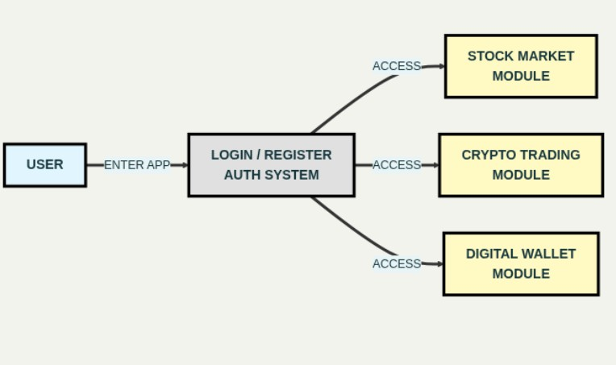
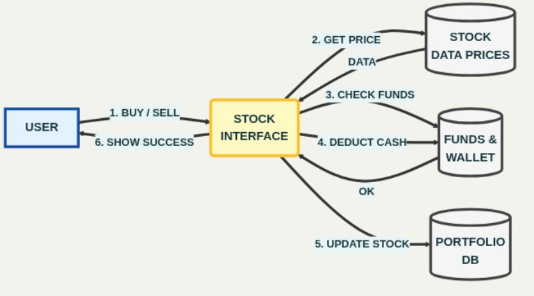
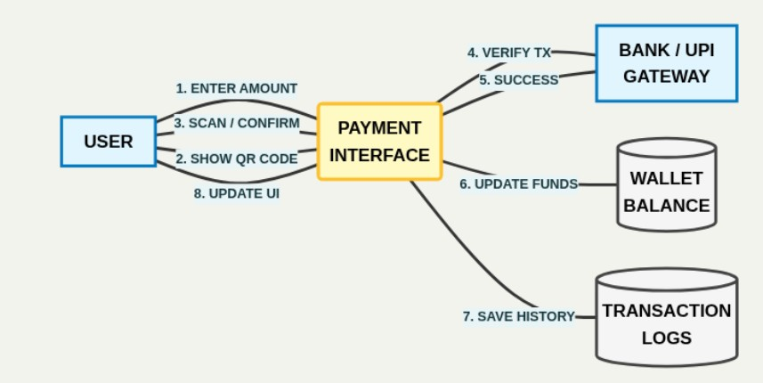

# Data Flow Diagrams (DFD)

This document describes the Data Flow Diagram (DFD) of the system.  
It represents how the user interacts with the application and how data flows between modules such as authentication, wallet, crypto, and stock trading.

---

## 1. Overall System Data Flow

This diagram shows the complete application flow.  
A user enters the app and must authenticate through the Login/Register system. After successful authentication, the user gets access to three main modules:

- Stock Market Module
- Crypto Trading Module
- Digital Wallet Module

---

## 2. Crypto Trading Module Data Flow

This diagram represents how crypto transactions and data exchange take place.

### Flow Description
1. User selects pair / triggers buy action in Crypto Interface.
2. Crypto Interface fetches live price data from **Binance API**.
3. Binance API returns prices as **JSON data**.
4. For executing a blockchain transaction, request signature is sent via **MetaMask Blockchain**.
5. A **Transaction Hash (TX Hash)** is generated after successful execution.
6. The system saves transaction details into **Transaction History** for tracking.

---

## 3. Stock Trading Module Data Flow

This diagram shows how stock buy/sell orders are processed.

### Flow Description
1. User sends Buy/Sell request through Stock Interface.
2. Stock Interface fetches real-time prices from **Stock Data Prices**.
3. It checks if the user has enough balance from **Funds & Wallet**.
4. If funds are available, cash is deducted.
5. Portfolio records are updated in **Portfolio DB**.
6. System sends confirmation and shows success to the user.

---

## 4. Payment / Wallet Module Data Flow

This diagram represents payment processing through UPI/Bank systems and wallet update.

### Flow Description
1. User enters amount in Payment Interface.
2. The system generates a QR code for payment.
3. User scans/ confirms payment via UPI.
4. Payment request is verified using **Bank / UPI Gateway**.
5. If success, confirmation is received.
6. Wallet balance is updated in **Wallet Balance**.
7. System stores transaction details in **Transaction Logs**.
8. UI updates and shows payment status to the user.

---

## Summary

This DFD structure ensures:
- Secure access using authentication
- Separate workflows for Crypto, Stock, and Payments
- Proper transaction tracking through logs/history
- Wallet-based fund validation for trading

The system is modular and scalable, allowing future enhancements like analytics dashboards, multi-region deployments, and real-time monitoring.
