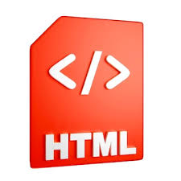
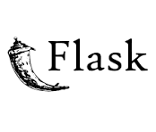
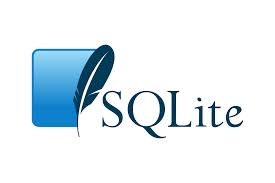

# Project Requirements (Technologies & Tools)

This document describes the technologies, languages, frameworks, and tools required to run and develop this project.

---

## 1. Frontend Requirements

The frontend is responsible for UI/UX and client-side interactions.

### ✅ Languages Used
- **HTML5** – Page structure and layout

- **CSS3** – Styling, responsiveness, and animations

 

- **JavaScript (ES6+)** – Client-side logic, API calls, form handling, validation

---

## 2. Backend Requirements

The backend handles authentication, business logic, API routing, and communication with the database.

### ✅ Framework Used
- **Flask (Python)** – Lightweight backend framework for server-side logic, routing, and APIs

### ✅ Language Used
- **Python 3.x**

---

## 3. Database Requirements

The database stores users, transactions, wallet details, and other system records.

### ✅ Database Used
- **SQLite3** – Embedded relational database for lightweight, fast local storage

---

## 4. Recommended Tools (Development)

These tools are optional but strongly recommended for smooth development.

### ✅ Tools
- **VS Code** / any IDE
- **Git + GitHub** for version control
- **Browser Developer Tools** (Chrome/Edge) for debugging
- **Postman** (optional) for testing API endpoints

---

## 5. Runtime Environment Requirements

To run the backend locally, ensure the following:

- Python **3.8+ (recommended)**
- Flask installed in the environment
- SQLite comes pre-installed with Python in most systems

---

