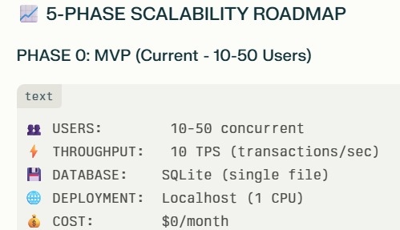
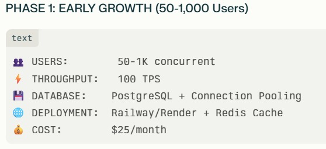
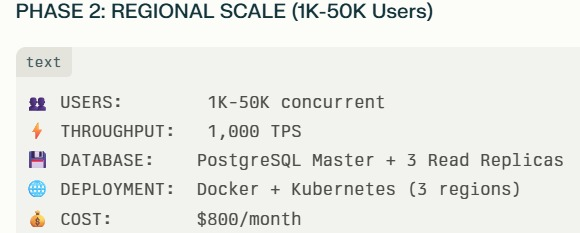
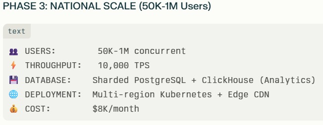
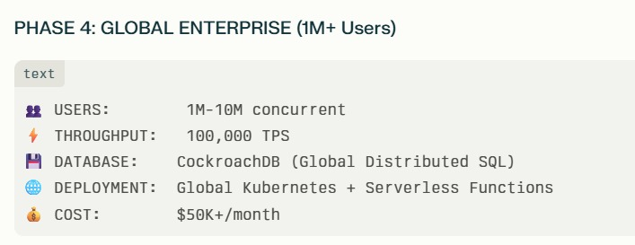

# Scalability Roadmap

This document defines the scalability phases of the system, including expected user concurrency, throughput targets, infrastructure upgrades, deployment strategy, and estimated monthly cost.  
The goal is to scale smoothly from MVP to global enterprise-grade architecture.

---

## Phase 0: MVP (10–50 Users)

**Target:** Initial validation / demo stage  
**Infrastructure:** Localhost / Single machine

- **Users:** 10–50 concurrent
- **Throughput:** Minimal / MVP load
- **Database:** Local / lightweight DB
- **Deployment:** Localhost
- **Cost:** **$0/month**

---

## Phase 1: Early Growth (50–1,000 Users)

**Target:** Early traction, stable hosting, basic caching  
**Infrastructure:** Railway/Render + Redis Cache

- **Users:** **50–1K concurrent**
- **Throughput:** **100 TPS**
- **Database:** **PostgreSQL + Connection Pooling**
- **Deployment:** **Railway/Render + Redis Cache**
- **Cost:** **~$25/month**

✅ Key upgrades:
- Introduce **Redis caching**
- Enable **connection pooling**
- Deploy on managed cloud hosting

---

## Phase 2: Regional Scale (1K–50K Users)

**Target:** Scale across regions, improve DB performance and reliability  
**Infrastructure:** Docker + Kubernetes (multi-region)

- **Users:** **1K–50K concurrent**
- **Throughput:** **1,000 TPS**
- **Database:** **PostgreSQL Master + 3 Read Replicas**
- **Deployment:** **Docker + Kubernetes (3 regions)**
- **Cost:** **~$800/month**

✅ Key upgrades:
- Add **read replicas** to reduce DB load
- Use **Kubernetes for orchestration**
- Deploy across **multiple regions** for low latency

---

## Phase 3: National Scale (50K–1M Users)

**Target:** Large-scale user base, high throughput, analytics-ready  
**Infrastructure:** Multi-region Kubernetes + Edge CDN

- **Users:** **50K–1M concurrent**
- **Throughput:** **10,000 TPS**
- **Database:** **Sharded PostgreSQL + ClickHouse (Analytics)**
- **Deployment:** **Multi-region Kubernetes + Edge CDN**
- **Cost:** **~$8,000/month**

✅ Key upgrades:
- Introduce **database sharding**
- Add **ClickHouse analytics layer**
- Use **Edge CDN** for faster content delivery
- Multi-region K8s to avoid bottlenecks

---

## Phase 4: Global Enterprise (1M+ Users)

**Target:** Worldwide availability, enterprise reliability, global distribution  
**Infrastructure:** Global Kubernetes + Serverless + Distributed SQL

- **Users:** **1M–10M concurrent**
- **Throughput:** **100,000 TPS**
- **Database:** **CockroachDB (Global Distributed SQL)**
- **Deployment:** **Global Kubernetes + Serverless Functions**
- **Cost:** **$50K+/month**

✅ Key upgrades:
- Use **distributed SQL (CockroachDB)** for global consistency
- Add **serverless components** for burst scaling
- Global infrastructure for enterprise-grade uptime

---

# Summary Table

| Phase | Users | Monthly Cost | Infrastructure |
|------|-------|-------------|----------------|
| MVP | 10–50 | $0 | Localhost |
| Growth | ~500 | $25 | Railway + Redis |
| Scale | ~5K | $150 | Docker + Kubernetes |
| Enterprise | 50K+ | $800 | Multi-region + Kafka |

---

## Notes & Best Practices

### Performance Enhancements
- Add **Redis caching early** (Phase 1)
- Move to **read replicas** (Phase 2)
- Use **sharding + analytics DB** (Phase 3)
- Use **distributed SQL** for global operations (Phase 4)

### Reliability
- Multi-region deployments from Phase 2+
- Implement observability:
  - Logs (ELK / Loki)
  - Metrics (Prometheus + Grafana)
  - Tracing (OpenTelemetry)

### Security & Compliance
- Enforce TLS everywhere
- Rate limiting + WAF (Phase 2+)
- Enterprise auth / RBAC (Phase 4)

---

✅ This roadmap ensures cost-effective scaling from MVP to enterprise-grade infrastructure while maintaining performance, availability, and data reliability.
